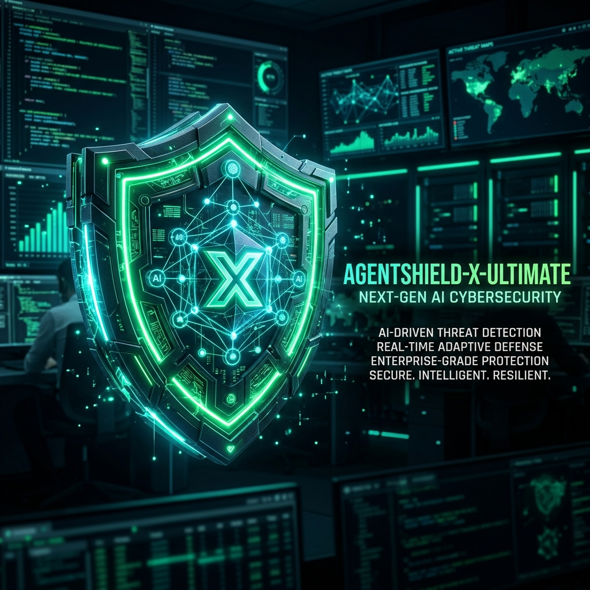
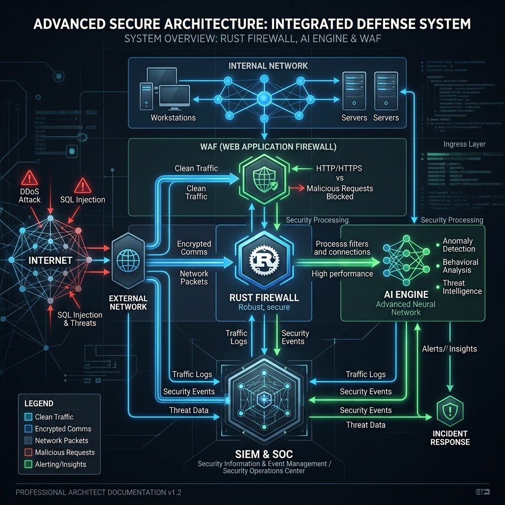
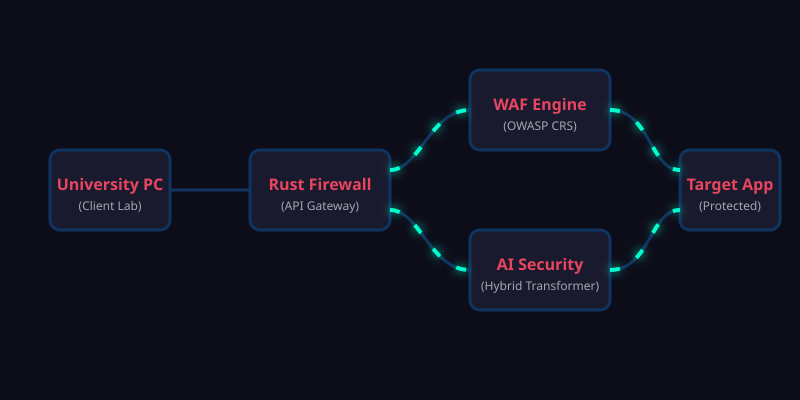
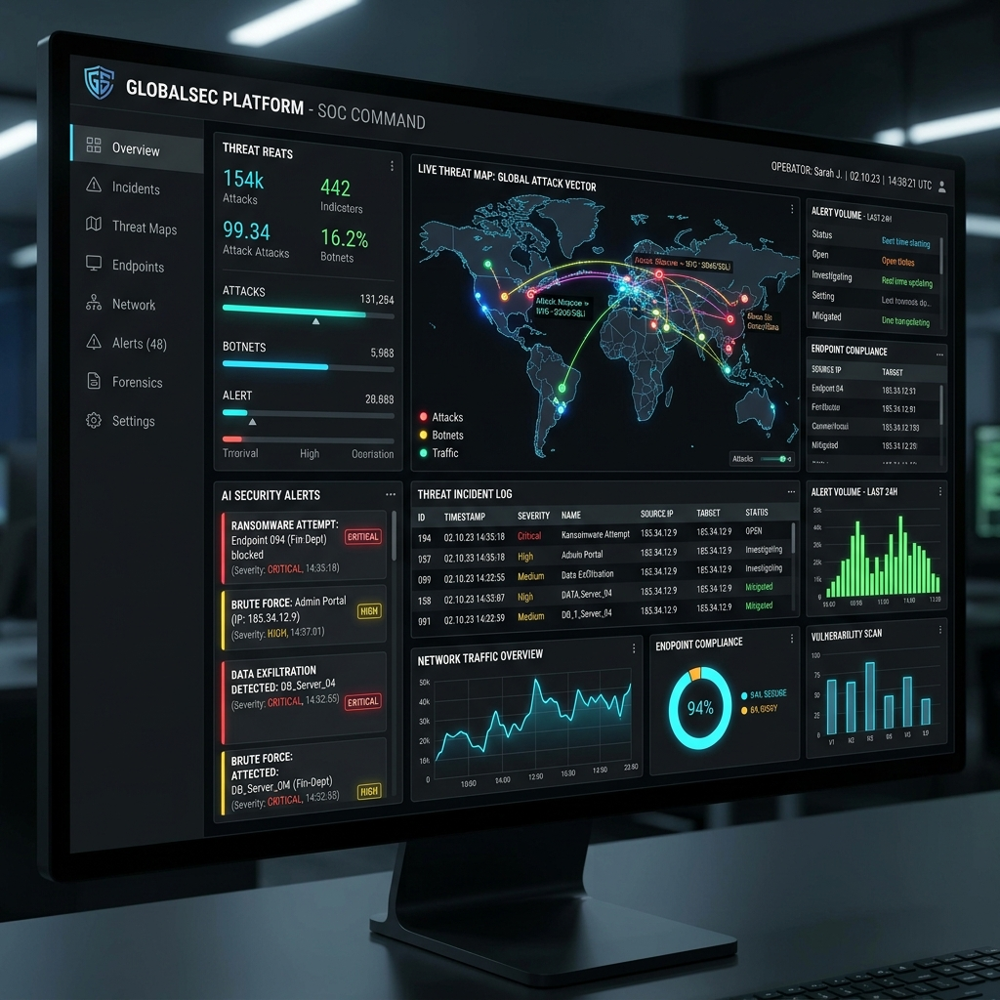

# AgentShield-X Ultimate

  

### Universal AI Security Firewall, Web Application Firewall, AI-Agent Guardrail and Security Operations Platform

AgentShield-X is a professional, industry-style defensive cybersecurity platform protecting Websites, REST APIs, AI Chatbots, LLM Applications, RAG Applications, AI Agents, Browser Sessions, and Developer APIs.

---

## 🚀 Target Audience: Who is this for?

This futuristic, high-end security project is designed for:
- **Enterprise Security Teams & SOC Analysts** needing a unified dashboard for modern threats.
- **AI & LLM Developers** looking to protect their language models from Prompt Injections, Jailbreaks, and Data Exfiltration.
- **Cybersecurity Researchers** studying the intersection of traditional WAFs and Machine Learning-based detection.
- **DevSecOps Engineers** building secure-by-default cloud-native infrastructure.

---

## 🎓 University Standard & Academic Excellence

Built with cutting-edge academic and industry standards, this project demonstrates advanced software engineering and security paradigms:
- **Microservices Architecture**: Segregation of duties using Rust for high-throughput proxying and Python for ML inference.
- **Deterministic vs Probabilistic Fusion**: Combines traditional OWASP rules (Deterministic) with Deep Learning Transformers (Probabilistic) for highly accurate threat detection.
- **Cyber-Vibe Aesthetics**: Includes a highly interactive, animated-style SOC dashboard designed to feel like a real-world, futuristic security control room.

---

## 🏗️ Architecture

  

- **Rust Firewall Gateway**: High-performance entry point.
- **WAF Engine (Coraza + OWASP CRS)**: Deterministic traditional web protection.
- **AI Security Engine (Python + HF Transformers)**: Machine learning-based detection for Prompt Injection, Jailbreaks, PII, and Secrets.
- **Risk Fusion Engine**: Combines WAF and ML signals.
- **Policy Engine**: Enforces Allow/Block decisions.

---

## 🎬 Motion Graphics Demo: How It Works in a University Lab

This animated flowchart demonstrates the data flow from a University Lab PC, passing through the Rust Firewall, analyzed by the WAF and AI Hybrid Transformers, before reaching the protected target.

  

---

## 🖥️ SOC Dashboard

  

- **Security Terminal & SOC Dashboard**: Real-time monitoring and management interfaces with a futuristic, cyber-themed design.

---

## 📂 Structure

- `frontend/`: AI-SOC Dashboard
- `rust-firewall/`: Rust Gateway
- `go-waf/`: Coraza + OWASP CRS WAF
- `python-ai/`: Hugging Face Transformers security engine
- `browser-extension/`: AgentShield-X Browser Guard
- `sdk-python/` & `sdk-js/`: Developer SDKs
- `security-terminal/`: Kali-style terminal interface
- `lab/` & `docker/`: Safe local testing environments
- `scripts/`: DevSecOps automation
- `tests/`: End-to-end and component tests
- `docs/`: Architecture and Threat Models
